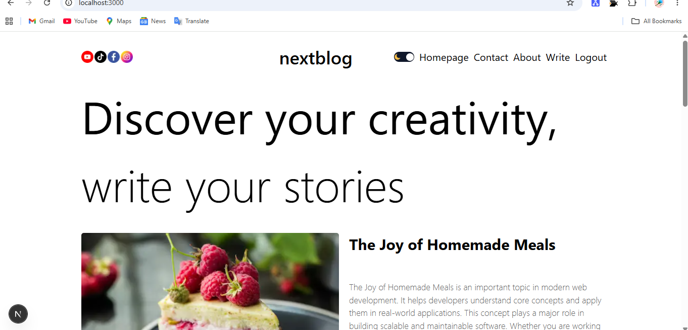
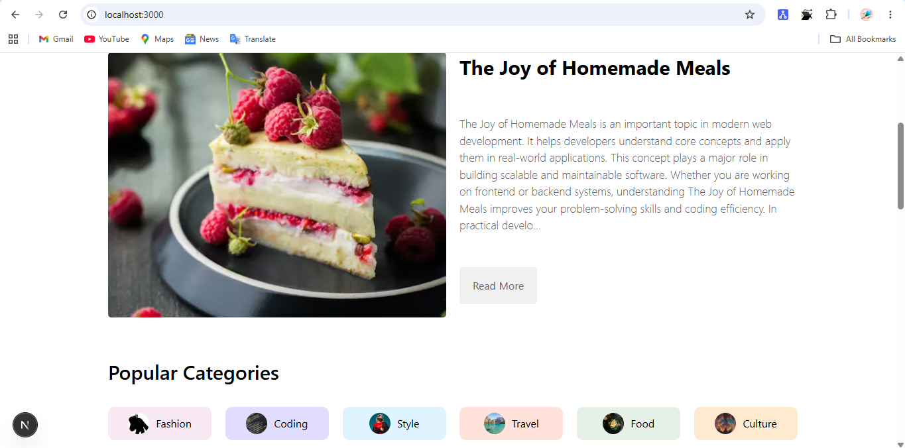
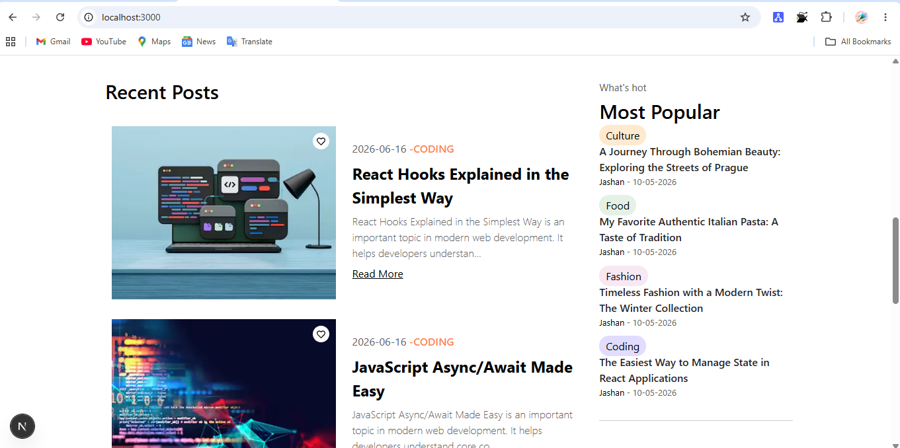
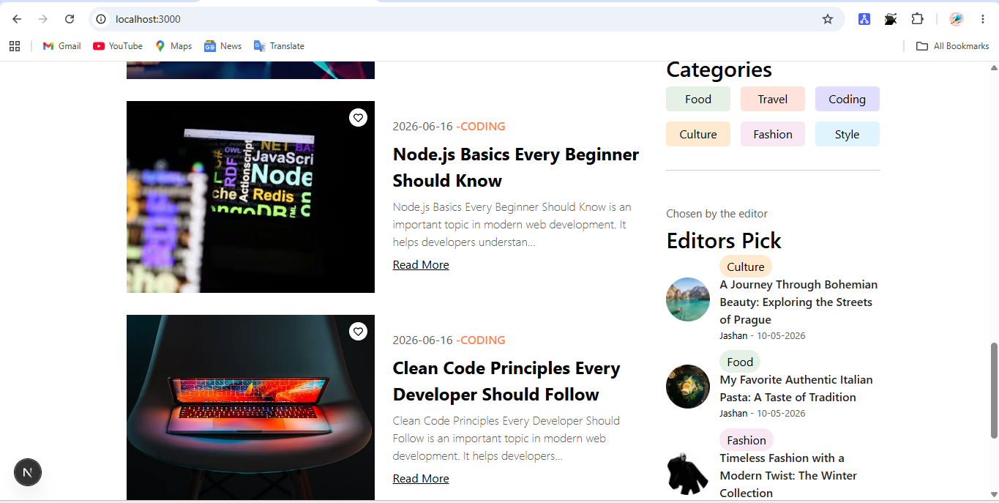
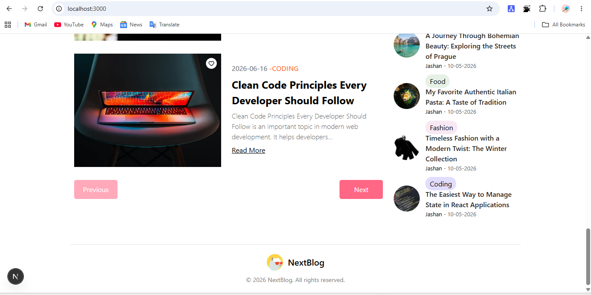

📝 NextBlog

A full-stack blogging platform built with Next.js where users can browse posts, filter by categories, authenticate with Google, and create blog content using a rich text editor.

🚀 Live Demo

https://your-vercel-url.vercel.app

📸 Screenshots
Home Page
 
 
 
 
 
 
Blog Categories

Single Post Page

Write Page

Login Page

✨ Features
Google Authentication with NextAuth
Create and publish blog posts
Category-based filtering
Rich text editor
Dynamic routing
Pagination
Responsive UI
🛠️ Tech Stack
Next.js
React
MongoDB
Prisma
NextAuth.js
CSS Modules
🚧 Project Status

Currently under active development.
More features will be added like search, edit/delete posts, and user profiles.
